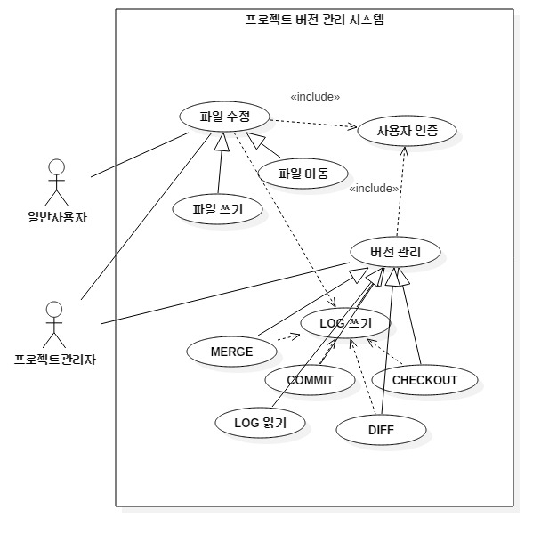
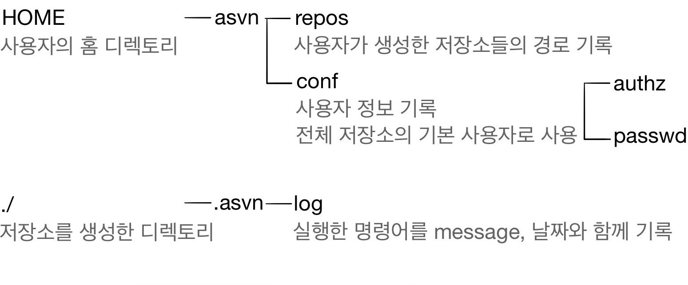
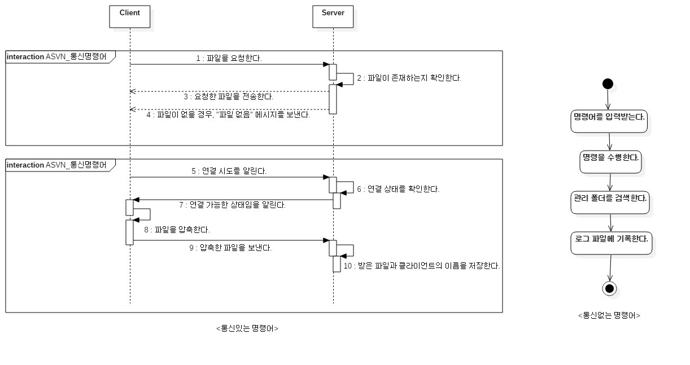
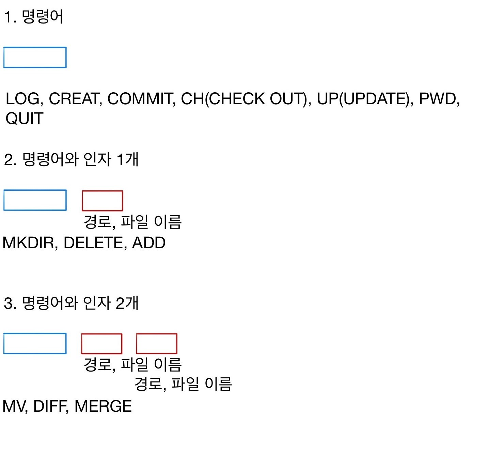
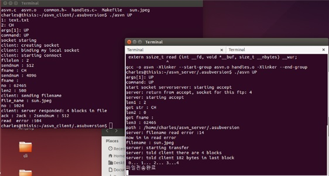
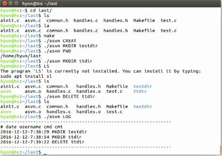

# ASVN

2016년, 시스템 프로그래밍 학기 과제용으로 만든 팀 프로젝트입니다.

FTP 프로그래밍을 이용하여 서버와 클라이언트 간의 파일 전송을 구현하고, 버전관리를 위한 기능을 구현합니다.

## Program Stacks

- C
- Ubuntu 16.04
- gcc
- make

## Program Design

### Usecase

### Files Design

### Command Design

### Running

## Reference Source

- https://github.com/Siim/ftp
